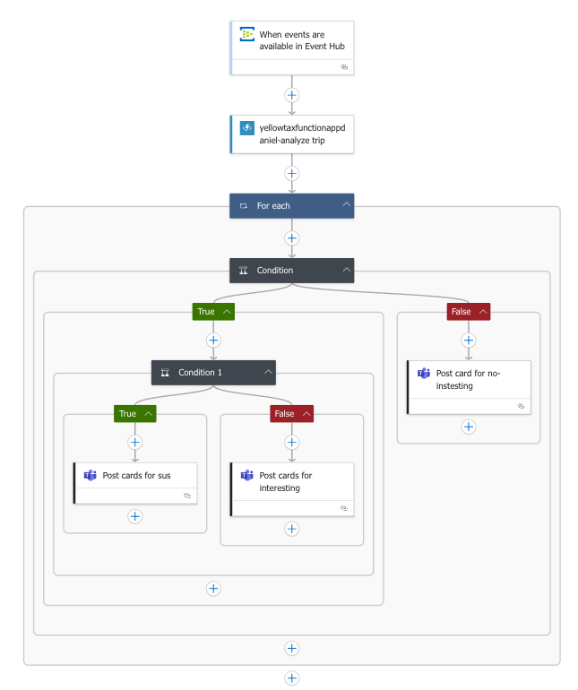

# CST8917 Lab 4: Real-Time Trip Event Analysis

## 🚕 Overview

This project simulates a real-time taxi dispatch monitoring system using an event-driven architecture on Microsoft Azure. The system ingests taxi trip data via Event Hubs, analyzes it using an Azure Function, routes it through a Logic App, and posts Adaptive Cards to Microsoft Teams for real-time insights.

This lab helps operations teams to:

- Automatically detect suspicious or interesting trips
- Monitor vendor behaviors
- Reduce manual effort in quality control

---

## 📡 Architecture Overview

**Components:**

- **Azure Event Hub:** Ingests real-time trip data
- **Azure Function:** Analyzes trip payload for anomalies (e.g., cash payments, group rides, short trips)
- **Azure Logic App:** Orchestrates the pipeline and triggers alerts
- **Microsoft Teams (via Webhook):** Receives Adaptive Card alerts

### 🔁 Data Flow

1. JSON trip event is sent to Event Hub
2. Logic App is triggered in batch mode
3. Logic App calls Azure Function to analyze the trip(s)
4. Logic App loops through function results
5. Based on `isInteresting`, posts appropriate Adaptive Card to Teams

### 🖼️ Architecture Diagram



---

## 🧠 Azure Function Logic

```python
trip = record.get("ContentData", {})
vendor = trip.get("vendorID")
distance = float(trip.get("tripDistance", 0))
passenger_count = int(trip.get("passengerCount", 0))
payment = str(trip.get("paymentType"))

insights = []
if distance > 10:
    insights.append("LongTrip")
if passenger_count > 4:
    insights.append("GroupRide")
if payment == "2":
    insights.append("CashPayment")
if payment == "2" and distance < 1:
    insights.append("SuspiciousVendorActivity")
```

> Returns a JSON object for each trip with an `isInteresting` flag and summary.

---

## 🔄 Logic App Design

**Trigger:**
- Event Hub trigger (batch mode)

**Steps:**
1. Call Azure Function with batch input
2. Loop through function output
3. Conditional branch:
   - If `isInteresting` is `true`: post 🚨 Interesting or ⚠️ Suspicious card
   - Else: post ✅ Normal trip card

---

## 💬 Adaptive Cards to Teams

### ✅ Normal Trip Card
- Indicates analyzed trip with no flags

### 🚨 Interesting Trip Detected
- Flags include: LongTrip, GroupRide, CashPayment

### ⚠️ Suspicious Vendor Activity
- Indicates cash + short distance → possible fraud

---

## 🧪 Example Input (JSON)

```json
{
  "ContentData": {
    "vendorID": "V1001",
    "tripDistance": 0.5,
    "passengerCount": 1,
    "paymentType": "2"
  }
}
```

### Example Output

```json
{
  "vendorID": "V1001",
  "tripDistance": 0.5,
  "passengerCount": 1,
  "paymentType": "2",
  "insights": ["CashPayment", "SuspiciousVendorActivity"],
  "isInteresting": true,
  "summary": "2 flags: CashPayment, SuspiciousVendorActivity"
}
```
---

## 🎥 Demo Video

Watch the full walkthrough here:  
👉 [YouTube Demo Link](https://youtu.be/DlauvDAElh4)

---

## 📁 Repo Structure

```
📦cst8917-lab4-trip-monitoring
 ┣ 📂logic-app
 ┃ ┗ logicapp-workflow.json
 ┣ 📂azure-function
 ┃ ┗ analyze_trip_function.py
 ┣ 📂screenshots
 ┃ ┗ Logic-App-Flowchart.png
 ┣ 📄 README.md
```

---

## 💡 Improvements & Insights

- Integrate with Azure Cognitive Services for NLP on customer feedback
- Add historical analysis via Synapse or Power BI
- Introduce severity levels to Adaptive Cards
- Add retry logic to Logic App for failed Teams posts


